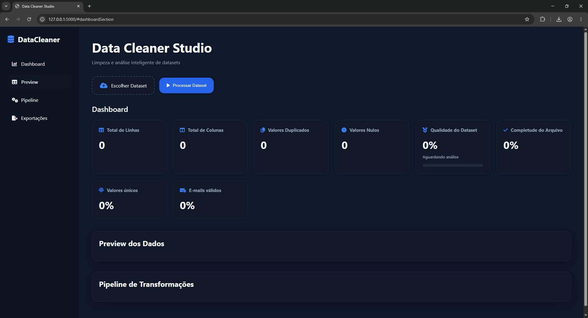

# 🚀 Data Cleaner Pro

Uma aplicação web moderna para importação, análise, limpeza e transformação de dados, inspirada na experiência do Power Query e construída com Python, Flask, Pandas, HTML, CSS e JavaScript.

---

## 📋 Sobre o Projeto

O Data Cleaner Studio foi desenvolvido para simplificar o processo de preparação de dados, permitindo que usuários realizem análises exploratórias, identifiquem problemas de qualidade e executem transformações sem necessidade de programação avançada.

A aplicação oferece uma interface intuitiva para:

* Importação de arquivos CSV, Excel e JSON
* Análise automática da qualidade dos dados
* Tratamento de valores nulos
* Remoção de duplicidades
* Padronização de textos
* Conversão de tipos de dados
* Dashboard de qualidade
* Histórico de transformações
* Exportação para múltiplos formatos

---

## 📸 Interface

### Dashboard Principal



## 🎥 Demonstração


---

## ✨ Funcionalidades

### 📂 Importação de Dados

* CSV
* XLSX
* JSON

### 🔍 Análise Automática

* Total de registros
* Total de colunas
* Valores nulos
* Duplicidades
* Tipos de dados
* Estatísticas descritivas

### 🧹 Limpeza de Dados

* Remover linhas duplicadas
* Preencher valores nulos
* Remover valores nulos
* Padronizar texto
* Converter tipos de dados
* Renomear colunas

### 📊 Dashboard de Qualidade

Indicadores automáticos:

* Quality Score
* Quantidade de registros
* Quantidade de colunas
* Valores ausentes
* Registros duplicados
* Distribuição dos tipos de dados

### 🕒 Histórico de Transformações

Cada modificação realizada é registrada, permitindo:

* Auditoria das alterações
* Rastreabilidade
* Possibilidade de reversão futura

### 📤 Exportação

* CSV
* Excel (.xlsx)
* JSON
* Parquet

---

## 🛠️ Tecnologias Utilizadas

### Backend

* Python
* Flask
* Pandas
* NumPy
* OpenPyXL
* PyArrow

### Frontend

* HTML5
* CSS3
* JavaScript (ES6+)

### UX/UI

* Interface responsiva
* Feedback visual em tempo real
* Dashboard analítico
* Experiência inspirada no Power Query

---

## 📁 Estrutura do Projeto

```text
DataCleaner/
│
├── app/
│   ├── services/
│   │   ├── importers.py
│   │   ├── exporters.py
│   │   ├── pipeline.py
│   │   ├── profiler.py
│   │   └── history.py
│   │
│   ├── static/
│   │   ├── css/
│   │   ├── js/
│   │   └── uploads/
│   │
│   └── templates/
│       └── index.html
│
├── routes.py
├── app.py
├── extensoes.txt
└── README.md
```

---

## ⚙️ Instalação

### 1. Clone o repositório

```bash
git clone https://github.com/Jullyoo/DataClenerStudio.git

cd (Nome da Pasta)
```

### 2. Crie um ambiente virtual

```bash
python -m venv venv
```

### 3. Ative o ambiente

Windows:

```bash
venv\Scripts\activate
```

Linux/Mac:

```bash
source venv/bin/activate
```

### 4. Instale as dependências

```bash
pip install -r extensoes.txt
```

### 5. Execute o projeto

```bash
python app.py
```

---

## 📈 Exemplo de Fluxo

1. Importe um arquivo CSV ou Excel.
2. Visualize o preview dos dados.
3. Analise o dashboard de qualidade.
4. Execute transformações.
5. Verifique o histórico.
6. Exporte o resultado final.

---

## 🎯 Objetivos do Projeto

Este projeto foi criado para demonstrar conhecimentos em:

* Desenvolvimento Web
* Engenharia de Dados
* ETL
* Manipulação de Dados com Pandas
* UX/UI
* Arquitetura de Software
* Boas práticas de desenvolvimento

---

## 🚀 Melhorias Futuras

* Drag and Drop para transformações
* Preview estilo Power Query
* Processamento assíncrono com Celery
* Conexão com bancos de dados
* Reversão completa de transformações
* Sistema de regras reutilizáveis
* Autenticação de usuários
* Deploy em nuvem

---

## 👨‍💻 Autor

Julio Cesar Teixeira Guimarães

Estudante de Análise e Desenvolvimento de Sistemas com foco em:

* Desenvolvimento Web
* Engenharia de Dados
* Business Intelligence
* Python
* Power BI
* SQL

---

## 📄 Licença

Este projeto está disponível para fins educacionais e de portfólio.
